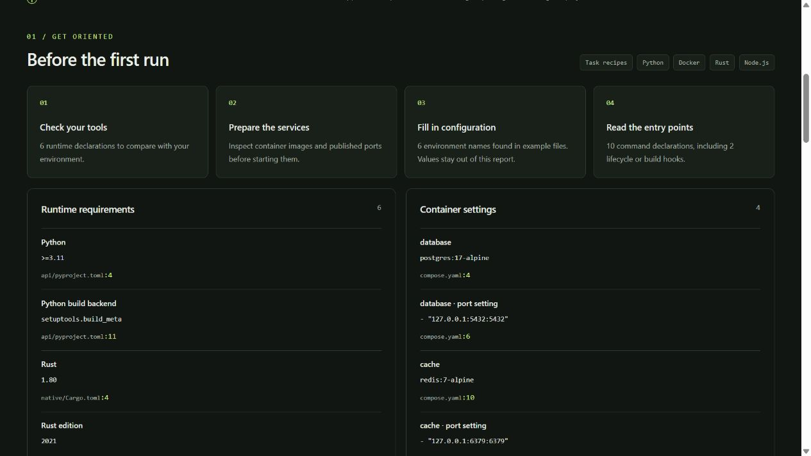

# SetupLens

**Understand a repository's setup before you run it.**

SetupLens turns local setup files into an onboarding map: runtime requirements, container services, environment names and command entry points, with source locations. It reads across Node.js, Python, Rust and Docker without running the target project, calling a model or making network requests.

[繁體中文](README.zh-TW.md) · [Example report](docs/demo-report.html) · [Supported inputs](docs/coverage.md) · [Contributing](CONTRIBUTING.md)



## Try it in 30 seconds

Requires **Python 3.11+**. From this repository's directory:

```console
python -m setuplens examples/atlas-demo
python -m setuplens examples/atlas-demo --format html -o setup-report.html
```

Open `setup-report.html` in your browser. It is a single offline file with searchable review notes, priority filters and a printable layout. The demo is a fictional, non-runnable fixture; the commands above inspect its files only.

To inspect another checkout, replace `examples/atlas-demo` with its local path. There is no target installation or dependency resolution step.

## Four questions, one report

| Before running a new repo… | SetupLens collects… |
| --- | --- |
| Which tools and versions does it declare? | Node engines, package manager, Python requirement and build backend, Rust metadata, Docker base images |
| Which services and ports should I review? | Simple Compose service images and port blocks; Dockerfile port metadata |
| What configuration do I need to look up? | Names from `.env.example`, `.env.sample` and other supported templates; values are omitted |
| Where are the entry points? | npm scripts, Python console scripts and literal setup calls, Cargo build scripts, Make/Just target declarations |

Review notes draw attention to setup choices such as install hooks, downloaded shell execution, privileged containers and recursive cleanup. They explain what to check and show the source evidence. Their priorities indicate review urgency, not a malware probability.

## Use it as a CLI

Installing this tool from the downloaded source exposes `setuplens`:

```console
python -m pip install .
setuplens /path/to/local/repo --format html -o report.html
setuplens /path/to/local/repo --format json -o report.json
setuplens /path/to/local/repo --format markdown -o report.md
setuplens /path/to/local/repo --exclude fixtures --exclude examples
```

`pip install .` installs SetupLens itself and may fetch build tooling. Running directly with `python -m setuplens` from the source directory needs no packages beyond Python's standard library. **This release has not been published to PyPI**; do not assume `pip install setup-lens` retrieves this project.

| Option | Behavior |
| --- | --- |
| `--format text\|json\|html\|markdown` | Text by default; reports go to standard output unless `-o` is supplied |
| `-o, --output PATH` | Create a report file; its parent directory must exist |
| `--force` | Replace an existing report; scanned inputs, environment filenames and linked destinations are protected |
| `--exclude PATTERN` | Repeatable directory name or relative path glob |
| `--max-files N` | Inspect up to 1–500 supported files; default 500 |
| `--fail-on high\|medium\|info` | Return exit code 1 for findings at or above that priority |
| `--strict` | Return 2 when inspection is incomplete; documented lexical limitations do not trigger it |

Normal completion returns 0, a requested finding threshold returns 1, and input/output errors or strict coverage failures return 2. A report may still be written before a nonzero status. Neither exit code 0 nor an empty findings list means the repository is safe or ready to run.

## Scope matters

This is an **alpha onboarding tool**. It reports declarations, not a verified installation plan. It does not infer execution order, check your installed tools, resolve dependency trees, read README instructions, run containers, audit vulnerabilities or prove safety. A variable named `DATABASE_URL` does not establish which external database is required.

JSON and TOML use standard-library parsers; `setup.py` uses Python's syntax tree without evaluating it. Shell, Docker, Compose, workflows and Rust build-script references use limited lexical inspection. Dynamic behavior, aliases, YAML anchors and generated configuration can be missed. Paths and line numbers help you inspect the source; manifest line matching is best-effort where keys repeat or use unusual formatting.

The scan skips real `.env` files, dependency/build directories, hidden directories except `.github`, symlinks and Windows reparse points. It has explicit file-size, count and depth limits and lists skipped inputs. Secret masking outside environment templates is best-effort: review reports before sharing them. See [coverage](docs/coverage.md) and [trust boundaries](SECURITY.md).

## How it fits alongside existing tools

Useful prior work already exists. [NodeSecure](https://github.com/NodeSecure/scanner) analyzes npm dependencies and detects install scripts. [OWASP dep-scan](https://owasp.org/www-project-dep-scan/) provides supply-chain analysis across ecosystems. SetupLens focuses on the first local read of a checkout: **tools, services, configuration and entry points in a portable report**. It does not replace those tools or claim to be the first cross-ecosystem analyzer.

## Development

```console
python -m unittest discover -s tests -v
```

Tests cover parsing, source locations, non-execution, output escaping, environment handling and CLI behavior. GitHub Actions is configured for Windows, Linux and macOS; a workflow file is not evidence that those remote runs have passed. See [validation notes](docs/validation.md) for the checks actually performed on this release.

Small contributions with reproducible examples are welcome. The next useful improvements are better Compose extraction, more precise source mapping, and clearer grouping of monorepo packages. See [CONTRIBUTING.md](CONTRIBUTING.md).

MIT licensed. No accounts, API keys, telemetry or runtime dependencies.
